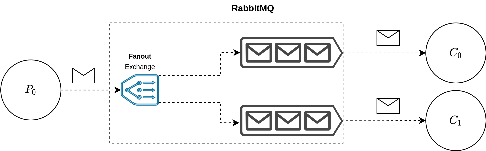

# RabbitMQ Hands-on
This github repository is created in order to facilitate the execution and implementation of the exercises that are proposed in the RabbitMQ Hands-on
## Getting started
### Prerequisites
- Python version >=3
- Pip version >= 20.0.2 
- Git version >= 2.25.1
- Docker version >= 20.10.7
### Installation
Install all the required dependencies using the following command:
```
pip install -r requirements.txt
```
### RabbitMQ: Message broker(docker)
Before running the programs, you must run rabbitmq message broker, this is achieved using the following docker commands:

1. We need to create a simple bridge network:

```
docker network create --driver=bridge --subnet=10.0.0.0/23 mynet
```

2. Run a docker container using the rabbitmq image

```
docker run --name rabbit-0 --hostname rabbit-0 -d -p 5672:5672 -p 8080:15672 --net mynet rabbitmq:3-management
```

### Example 0: Hello word 
This example show you how to produce and consume message using Python as a programming language. the example is summarized by the following diagram:  


### Example 1: Manager / worker pattern
This example tries to show the behavior of very simple processing pattern called manager worker using a FANOUT exchange. 



```A fanout exchange routes messages to all of the queues that are bound to it and the routing key is ignored.```


### Exercise 0:
Modify the Manager / Worker exercise to send a different message to each worker.

### Final test: Divide & Conquer
The final test consists of reusing the code given by Manager / Worker example to add a consumer and then join the result obtained from the Workers.
### Extra:
- Create a type definition for the exchange's type, for example: ExchangeType.DIRECT | ExchangeType.FANOUT | ExchangeType.TOPIC
- Implement a more reusable join function that allows you to create more complex join operations. 

## Author(s)
- Jesus Ignacio Castillo Barrios 
