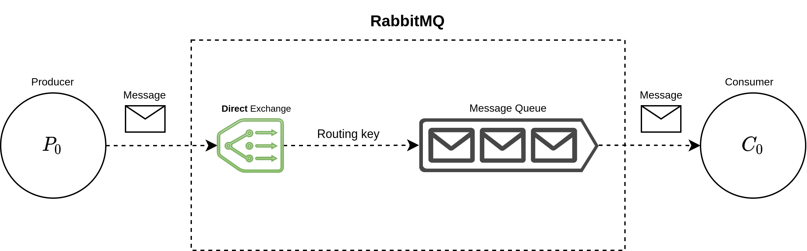

# RabbitMQ Hands-on
This github repository is created in order to facilitate the execution of the programs.

## Getting started
### Example 0: Hello word 
This example show you how to produce and consume message using Python as a programming language. the example is summarized by the following diagram:  


#### Example 1: Manager / worker pattern
This example tries to show the behavior of very simple processing pattern called manager worker using a FANOUT exchange. 
~[ex1](./images/ex1.png)
```A fanout exchange routes messages to all of the queues that are bound to it and the routing key is ignored.```


#### Exercise 0:
Modify the Manager / Worker exercise to send a different message to each worker.

### Final test: Divide & Conquer
The final test consists of reusing the code given by Manager / Worker example to add a consumer and then join the result obtained from the Workers.
### Extra:
- Create a type definition for the exchange's type, for example: ExchangeType.DIRECT | ExchangeType.FANOUT | ExchangeType.TOPIC
- Implement a more reusable join function that allows you to create more complex join operations. 

## Author(s)
- Jesus Ignacio Castillo Barrios 
